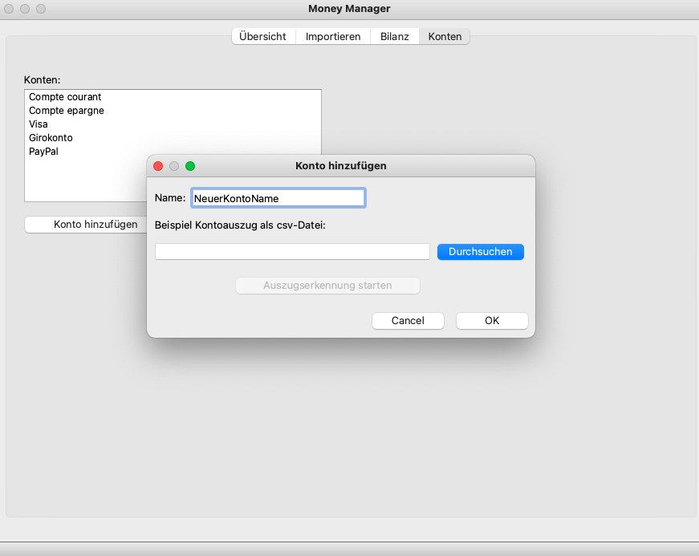

# MoneyManager: Finance Organizer with Python

##Beschreibung
Der MoneyManager hilft dabei die Übersicht über die eigenen Finanzen zu behalten. Dabei können alle unterschiedlichen Arten von (Bank) Konten oder Bezahlmethoden (PayPal, etc.) eingebunden werden. Die Ein- und Ausgaben werden semi-automatisch kategorisiert und es können monatliche und jährliche Bilanz PDFs erstellt werden, die einem somit den Überblick über die eigenen Finanzen ermöglichen.

##Voraussetzungen
Die Voraussetzung an das Konto bzw. Bezahlmethode, die man in das Programm einbinden möchte, ist das man im Online-Banking die Kontoauszüge oder ausgewählte Transaktionen als csv-Datei exportieren kann.

Das Skript läuft komplett unter Python. Entsprechend dafür sind Python und einige Python packages, die in requirements.txt definiert sind, nötig. Zur Installation von denen ist pip,conda, o.ä. notwendig.   


## Installation
Das Github Repo als zip-Datei downloaden oder mit git clonen:

```
git clone https://github.com/LorisSchmit/MoneyManager.git
```

Danach ein Terminal bzw. Kommandozeile-Fenster öffnen und in den Installationsordner navigieren.

Wenn python3 und pip noch nicht installiert sind, dann hier downloaden und installieren:  

* __Python__: https://www.python.org/downloads/  
* __pip__: https://pip.pypa.io/en/stable/installation/

Als nächstes können mit pip die requirements installiert werden:

```
pip install -r requirements.txt
```
## Start

Das Programm kann gestartet werden mit:
 
 ```
 python3 gui.py
 ```
## Benutzung

### Konten hinzufügen
Als Erstes muss die einzelnen Konten bzw. Bezahlmethoden als Konto angelegt werden. Dafür unter dem Tab Konten __Konto hinzufügen__ auswählen.

Im folgenden Dialog kann ein Kontoname gewählt werden. Dann wird ein beispielhafter Kontoauszug als csv-Datei gebraucht von der entsprechenden Konto. Diese csv-Datei kann mit dem __Durchsuchen__-Button ausgewählt werden.



Wenn eine gültige csv-Datei ausgewählt wurde kann die Auszugserkennung mit dem entsprechenden Knopf gestartet werden.

Die Auszugserkennung ist nötig um aus den csv-Dateien, die essenziellen Informationen zu entziehen und die unnötigen Informationen zu löschen.

Unnötigen Zeilen und Reihen können mit einem Einfach-Klick auf die Kopfzeile ausgewählt werden und mit dem __Ausgewählte löschen__-Button gelöscht werden.

![ausgewaehlt loeschen] (readmepics/loeschen.png)

Wenn das erledigt ist werden die einzelnen Spalten dem entsprechende Titel zugewiesen. Dafür mit Doppelklick auf die Kopfzeile und dann den entsprechenden Begriff auswählen.  
<sub> (Gibt es noch eine Spalte für das Vorzeichen, weil alle Beträge im Absolutwert dargestellt sind, müssen nach der Definition der Vorzeichenspalte noch die Zeichen angegeben werden, die für Ein- und Ausgabe stehen)</sub> 

Anschließend kann noch der string, den alle Dateien dieses Kontos gemeinsam haben und mit dem die Dateien dieses Kontos in Zukunft erkannt werden können, gesetzt (wenn er nicht automatisch gesetzt wurde) oder verändert werden.

Wenn es Transaktionstypen gibt die man nicht importiert haben möchte (zBsp Währungsumrechnungen), dann können diese auch angegeben werden. Als letztes muss noch angegeben werden, in welchem Format das Datum dargestellt ist.

### Importieren

Nachdem das Konto hinzugefügt wurde können im Importieren Tab Transaktionen von diesem Konto automatisch erkannt und importiert werden. Im Laufe des Import-Prozesses müssen noch die einzelnen Transaktionen kategorisiert werden. Dies geschieht anfänglich größtenteils manuell, das Programm lernt aber mit der Zeit welche Ausgaben und Eingaben welcher Kategorien angehören.

Um den Import zu starten gibt es zwei Möglichkeiten:   

1. ein Import-Ordner wird festgelegt, über den Dateien per Drag&Drop importiert werden können
2. Dateien können auch einzeln ausgewählt werden und importiert werden

![import] (readmepics/import.png)

Wird ein Datei geladen, müssen alle Transaktionen kategorisiert werden. Dafür erscheinen der Reihe nach Transaktionen in der Tabelle. Diesen muss jetzt in der Textzeile eine Kategorie zugewiesen werden. In der __Speicher als__-Textzeile wird ein Vorschlag gegeben Zahlungsempfänger/Sender zu speichern damit in Zukunft Zahlung von/an diesen automatisch erkannt werden. Wird dies gewünscht dann auf __Speicher__ drücken ansonsten auf __Nein__.

### Monatliche und jährliche Bilanz

Wenn nun alle Transaktionen importiert wurden kann unter dem Tab Bilanz eine monatliche und jährliche Bilanz erstellt werden. Dafür musst zuerst ein Ordner definiert werden in dem diese abgespeichert werden.

Dann kann man ganz einfach über die jeweilige Textzeile den entsprechenden Monat oder Jahr angeben und die Bilanz PDF wird automatisch erstellt.


